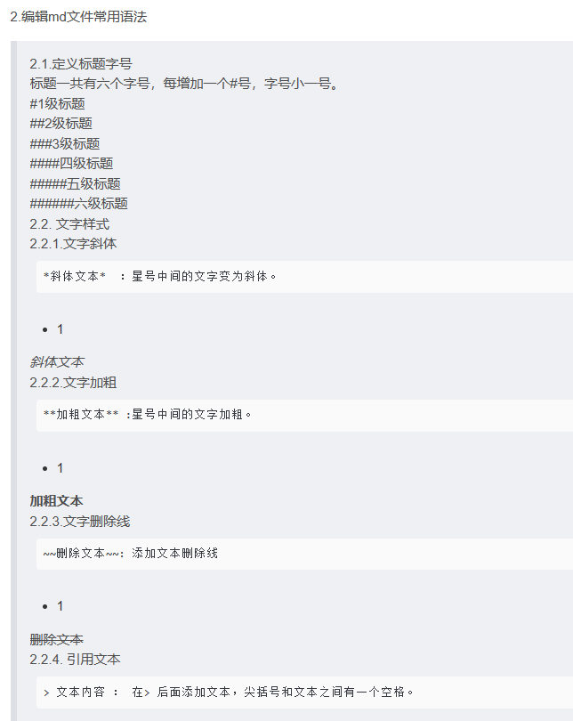
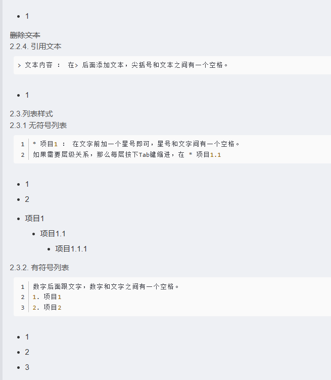

选中一段Ctrl+d可以复制一整段
Ctrl+alt+l美化代码

创建数组的方式：

1.使用数组直接量：可以直接在代码中指定数组的元素，
例如：
int[] arr = {1, 2, 3, 4, 5};

2.用静态初始化：在创建数组的同时为数组元素赋初值，
例如：
int[] arr = new int[]{1, 2, 3, 4, 5};

3.使用new关键字：使用new关键字来动态创建数组，
例如：
int[] arr = new int[5];

