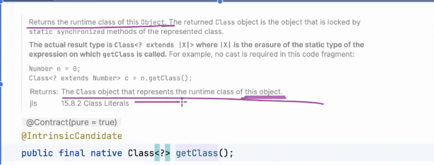

1.***ctrl+shift+u* (选中后后可以改变大小写)**

2.***debug***
* 
* 

3.**查看父类**
* 
* 
* persion.getClass()：获取对象persion的运行时类的Class对象。
* getSuperclass()：Class类中的方法，用于获取当前类的父类的Class对象。

4.**重写**
* 4.1
  * 
* 4.2 Override(toString)
* 需要添加 @Override 标识
  * 
* 4.3
  * 
  * 

5.***@Deprecated***
* 
