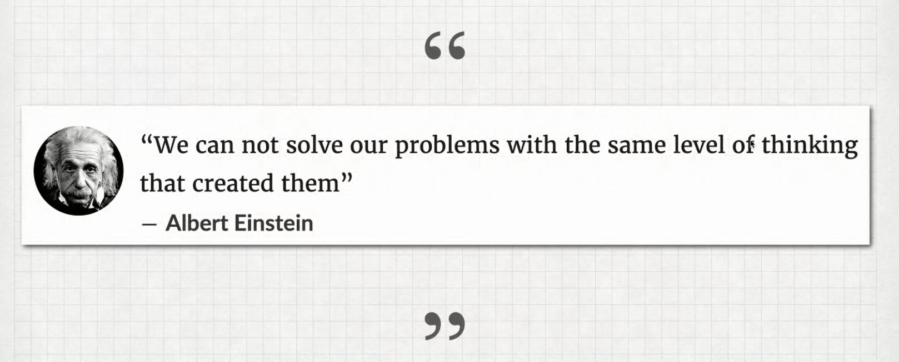
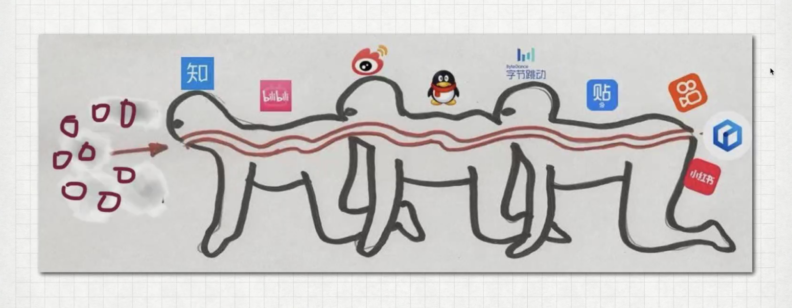

### 一.www
means——World Wide Web

- --
### 二.html 
- --
    1.<h2>二级标题</h2>
- <h2>二级标题</h2>
- --
    2.跳转链接 <a href="https://gitee.com/the-alley-where-the-wind-lives">rhythm的个人主页</a>
<a href="https://gitee.com/the-alley-where-the-wind-lives">rhythm的个人主页</a>
- --
    3.插入图片
- 
- alt后的内容可以为图片丢失时做解释

- --
- 4.List
- --
    4.1.无序listul>li*3
    <ul type="square">设置点成方形
    <li></li>
    <li></li>
    <li></li>
    </ul>
<ul type="square">
    <li></li>
    <li></li>
    <li></li>
</ul>

- --
    4.2. 有序list快捷生成：ol>li*3
    <ol type="a">数字变成小写字母
    <li></li>
    <li></li>
    <li></li>
    </ol>

<ol type="a">
    <li></li>
    <li></li>
    <li></li>
</ol>

- --
    5.制表
    <table border="1" width="100%">
    <tr>
        <td>姓名</td>
        <td>性别</td>
        <td>年龄</td>
        <td>操作一</td>
        <td>操作二</td> 
    </tr>
    <tr>
        <td>小红</td>
        <td>女</td>
        <td>12</td>
        <td colspan="2" align="center">睡觉</td>
    </tr>
    <tr>
        <td>小明</td>
        <td rowspan="2">男</td>
        <td>13</td>
        <td>捣蛋</td>
        <td>睡觉</td>
    </tr>
    <tr>
        <td>小黄</td>
        <td>12</td>
        <td>写作业</td>
        <td>吃饭</td>
    </tr>
    </table>
<table border="0" width="100%">
    <tr>
        <td>姓名</td>
        <td>性别</td>
        <td>年龄</td>
        <td>操作一</td>
        <td>操作二</td> 
    </tr>
    <tr>
        <td>小红</td>
        <td>女</td>
        <td>12</td>
        <td colspan="2" align="center">睡觉</td>
    </tr>
    <tr>
        <td>小明</td>
        <td rowspan="2">男</td>
        <td>13</td>
        <td>捣蛋</td>
        <td>睡觉</td>
    </tr>
    <tr>
        <td>小黄</td>
        <td>12</td>
        <td>写作业</td>
        <td>吃饭</td>
    </tr>
</table>

