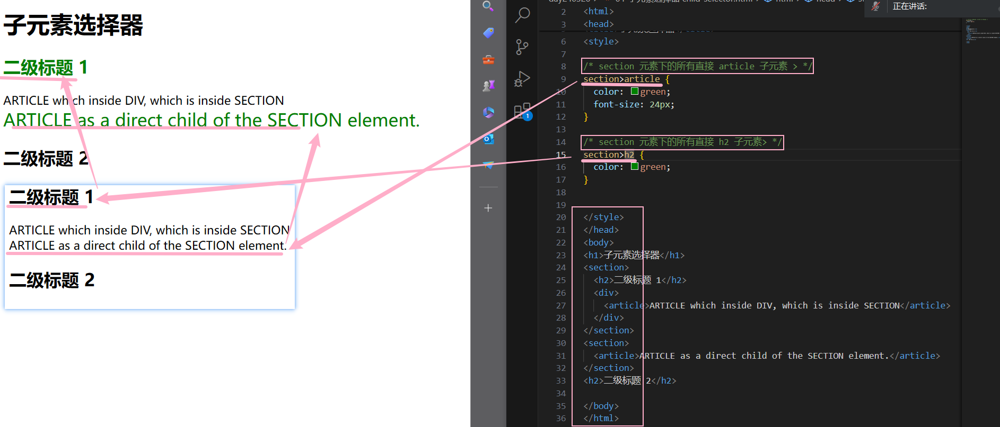

### 一.Visual Studio Code Format Code
- 作用：工整代码
-  
- --

### 二.基础选择器
- (1)<标签 属性="属性名"">被包裹内容</标签>
- - 1.一般情况下，可以在style{}中直接直接使用 标签{} 对被包裹内容修改属性
- - 2.当属性为class时，需要通过 .属性名 的方式进行修改
- - 3.当属性为id时，需要通过 #属性名 进行修改

- 
- 
- --

- (2)当属性名不同的俩个class可以同时在一个 {} 中同时改变属性，中间需要用逗号（,）隔开
- 
- --

- (3)
- --

- (4)只修改相邻的下一层级( a( b( ) ) 和 a( c( b( ) ) ) ,只修改a( b( ) ) 中的b)，可以用>来精确定位：a>b
- 
- --

- (5)相邻兄弟
- 
- --

- (6)普通兄弟
- 
- --

### 三.伪元素
- 伪元素中间会有俩个连续的冒号
- (1)
- (2)
- (3)
- (4)
- (5)
- (6)
  <pre>
  <label for="email">Email address</label>
  <input type="email" placeholder="请输入邮箱地址" id="email" size="25"/>
  </pre>
- 