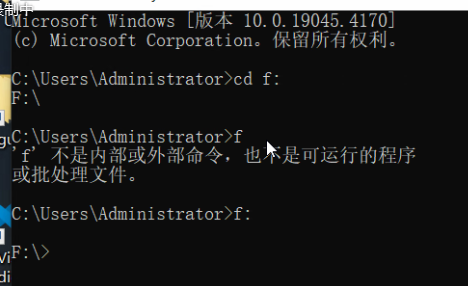
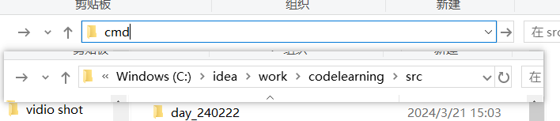
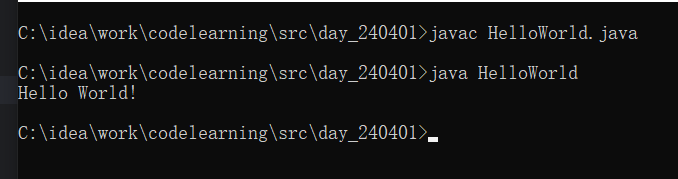
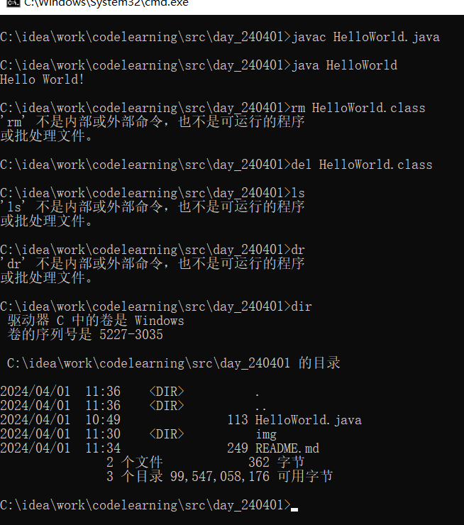
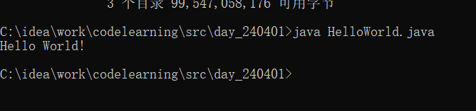
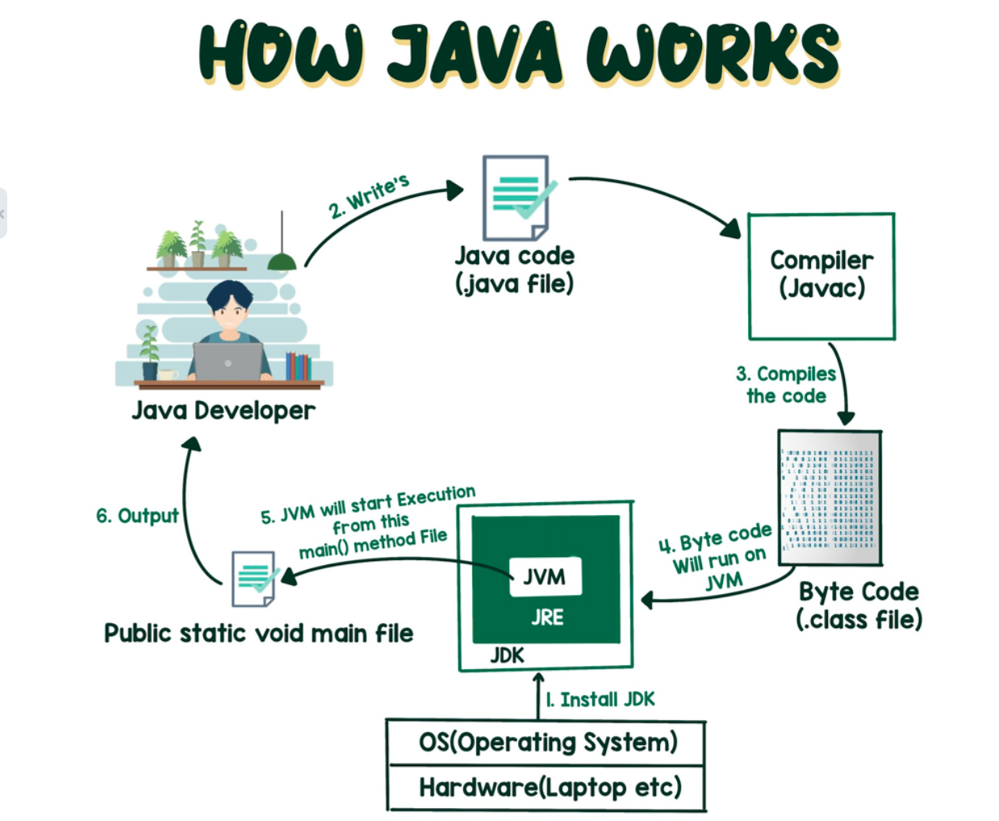

### 在命令提示符窗口从c盘进入d盘：

### HelloWrold
    public class HelloWorld{
    public static void main(String[] args){
    System.out.println("Hello World!");
        }
    }

- --
- 打开命令提示符窗口：
  - 1.win+r：cmd
  - 2.资源管理器中直接输入cmd

- 编译、运行

- 删除文件夹del、陈列dir出当前文件夹

- 新的命令直接运行结果：java 文件名.java

- java工作流程

- --
### 注释
- //:单行注释（ctrl+/）
- /*...*/:多行注释（ctrl+shift+/）

### 联系到gitee
- 已经在idea上创建好文件，后续在gitee上建立仓库，然后将仓库与自己的文件联系起来

