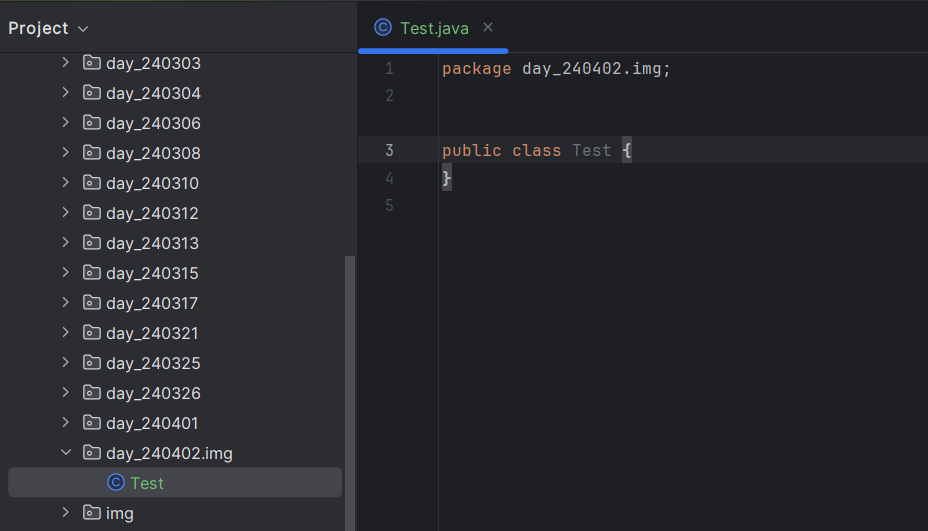

### 包名问题
- 如何修改

当第一个包下没有其他文件而直接新建第二个包时，第一个包不会显示折点选项，在此文件夹建立的项目会被默认添加到第二个包，可以通过删除 .第二个包名 让idea报错显示出可修改选项

- --

>-补充：简历上 `java开发工程师` -> `Java开发工程师` -> `Java 开发工程师`
- --

### 命名规范
- 1.注意大小写

    大小写不同的变量名代表的是俩个不同的变量 eg: A 和 a
- 2.变量名中间不允许空格
- 3.命名时尽量使用完整单词代替缩写
- 4.关键字和保留字不允许被用作变量名 eg:public、togo
- 5.不能以数字开头
- 注： -$ 和 _ 可以作为命名开头但不建议;甚至你可以 int 中文名 = number; 也是可以的但同样也不建议

- --
### 数据类型
(按类型分类)
- 1.基础数据类型（四类八种）：
  - （1）整形
    - int:1字节（8位） -128~127
    - short:2字节（16位） -32768~32767 , -2^15~2^15-1
    - int:4字节（32位） -2^31~2^31-1 , 约21亿
    - long:8字节（64位） -2^63~2^63
  - （2）浮点型
    - float:4字节（32位）
    - double:8字节（64位）
  - （3）char类型
    - char: 2字节（16位）
  - （4）布尔型
    - boolean: true、false

- 2.引用数据类型：
  - （1）类
  - （2）接口
  - （3）数组