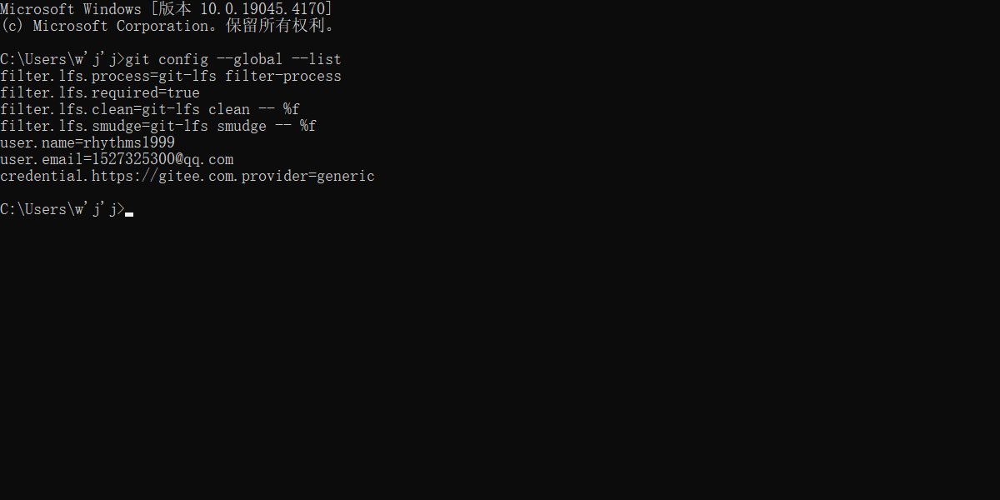

### 英文名
- 1.Arithmetic：n.算术；算术运算；四则运算
- 2.Assignment：n.任务；布置；作业；分配；转让

### 查看git账户
> git config --global --list

### 笔记--关于变量的的一些问题
- 1.Java 规定在 main 方法中定义的变量一定要给初始值，不然在使用时会报错。
- 2.其他位置定义的变量为定义初始值没有赋值时系统可能会给一个默认的初始值。
- 3.方法内定义的变量只能作用于当前方法内（当前作用域：scope），所以不同方法内可以起同名变量，但不建议。

### Literals 字面量
在 Java 中，整形变量会在字面上被认为成 int 型，所以当数据长度需要使用到 long 时直接使用会报错，需要在数字结尾加上 L 标识。
同理，浮点型会被默认为 double ，即 float a = 0.1 是不可以的，需要 float a = 0.1F 就可以了；

### 基础数据类型变量的运算处理
- byte、short、char 在进行运算时都会被当做 int 类型进行处理

### 数字中的下划线
  为了增加对很长数字的可读性，可以在数据间添加下划线，虚拟机会忽略下划线只读取数据本身。

- 使用需要注意下划线不能出现在以下位置
  - 1.数字的开头或结尾
  - 2.与小数点相邻
  - 3.与 f 或 F 相邻
  

  
