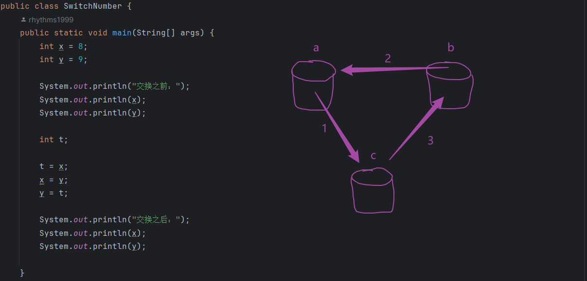

### 笔记
- 字符串加上任何的数据类型结果仍然是字符串（注意是字符串类型在前面）

- --
### 用户输入
    Scanner scanner = new Scannner(System.in);
    int Number = scanner.nextInt();// String msg = scanner.next();
- 1.创建用户输入
- 2.定义一个变量用于接收用户输入的数据

### 变量交换
    int a = 1;
    int b = 2;
    int c;
    c = a;
    a = b;
    b = c;

### 循环
- 1.for: 需要确定明确的循环次数
- 2.while: 在循环次数不确定时优势明显
- 3.do~while: 不管三七二十一，都会优先执行一遍
    

