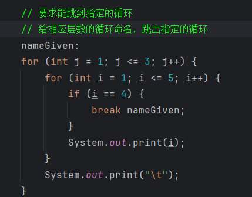

### 三元运算符
> a >= b ? a : b
- true为a，false为b

### break、continue、以及 break to any loop
- 1.break 是打断当前层次的循环，如果循环有很多层，那么只能打破 break 所在的那一层

- 2.continue 是跳过循环中的某一次，即达成某条件的时候少执行一次循环

- 3.给想要跳出的的循环层次命名，break +所命名即可跳出所命名的循环

- 结果:

- 

### 数组
- 同一数组中存放的数据:
    - 1.大小固定
    - 2.类型相同

### 逻辑运算符
- & : 与
- | : 或
- ！: 非
  - &&: 前面如果是false就不会再执行后面
  - &: 前后都会执行
  - ||: 同理，前面是true就不会执行后面
  - |: 前后都会执行