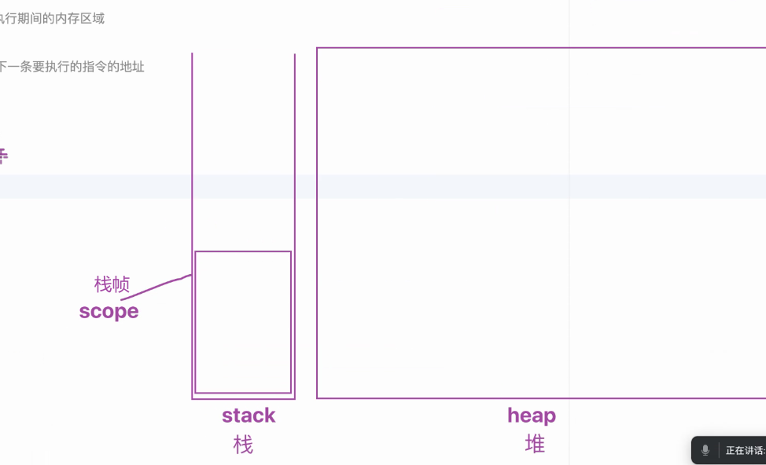
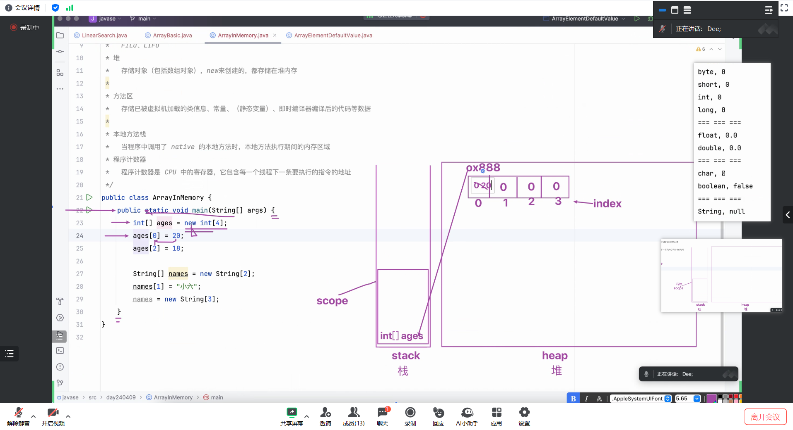

### 遇到的第一个数组？
- 其实是 public static void main（String[] args）{ } 中的 args ，我们可以通过以下方式向里面传参数

- 传进去4和88后数组长度从0变到了2

### 各种数据的初始值
- 在不定义初始值的情况下，系统默认的初始值

### 内存分配示意图
- 每个方法都会在 stack（栈）中开辟一个新的 scope （称为栈帧）

