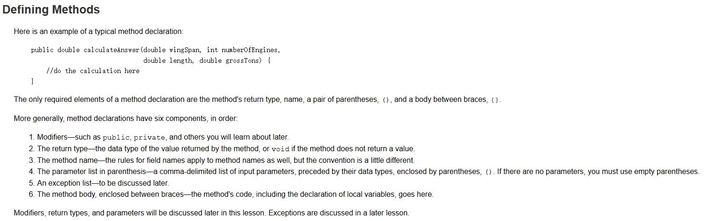

### 思维导图

### 笔记
- Method(behavior、方法) -> local variable(局部变量) :这里面的变量必须要有初始值。
- field(state、状态、域) -> member variable(成员变量) :这里的变量在不赋值的情况下，Java会给它默认的初始值
- 对象（object）：万物皆对象，对任何一个对象都可以抽象出他的行为（behavior）和状态（state）
- 类（class）：是用来创建一个对象的蓝图，类比下来即是一个物种，而 object 就是其中的一个个体
- `(1)Class unique` = `(2)new Class();`
  - (1)创建一个 Class 类型的名字叫 unique 
  - (2) new 实例化这个对象

### 构造器
权限修饰符+类名（参数类型：参数） { 方法体 }

### 构造器的作用
构造器（Constructor）是一种特殊类型的方法，用于在创建对象时初始化对象的实例变量。构造器的作用包括：

- 初始化对象：构造器用于初始化新创建的对象，为对象的实例变量赋予初始值。
- 创建对象：构造器在创建对象时被调用，确保对象被正确初始化。
- 提供默认值：如果没有显式定义构造器，Java会提供一个默认的无参构造器，用于初始化对象的实例变量。
- 可以重载：可以定义多个构造器，通过参数列表的不同来实现构造器的重载，以满足不同的对象创建需求。

总之，构造器的作用是初始化对象并确保对象在创建时处于正确的状态。

### 方法
- 1.权限修饰符
- 2.返回值类型，如果没有返回值类型
- 3.方法名:首个单词字母小写后面单词首字母大写
- 4.参数
- *5.异常处理
- 6.方法体

### 重载Overload
重载通俗意义上来说就是可以有名字相同的方法，但是他们的方法签名不同，也就是参数类型不同
- JVM 判断是否为同一方法看的是方法签名
- 方法签名包括方法名和参数类型（类型和个数）